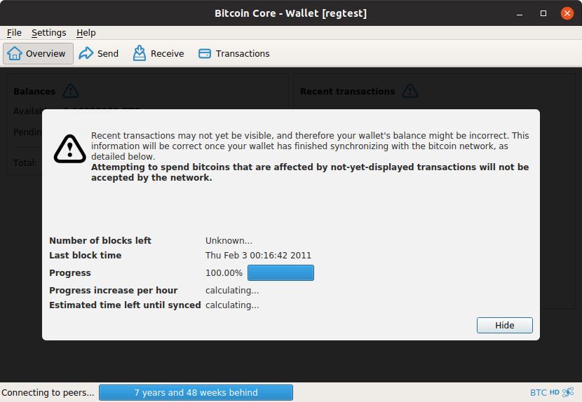

# Lightning In Action

## Installation

To make running this demo simple, we suggest that you create a specific directory to store configuration files and data. 
We will refer to this directory as $DEMODIR

### JDK
Download and install JDK8 from https://www.oracle.com/technetwork/java/javase/downloads/jdk8-downloads-2133151.html
Check that Java is installed properly:
```
java -version
```

### Bitcoin Core
Download bitcoin core from https://bitcoin.org, and create a specific bitcoin directory in $DEMODIR.

Add the following bitcoin.conf file in $DEMODIR/bitcoin:

```
server=1
rpcuser=foo
rpcpassword=bar
txindex=1
zmqpubrawblock=tcp://127.0.0.1:29000
zmqpubrawtx=tcp://127.0.0.1:29000
addresstype=p2sh-segwit
```

:warning: If you are using Bitcoin Core 0.17.0 or newer you need to add following line to your `bitcoin.conf`:
```
deprecatedrpc=signrawtransaction
```

Start bitcoin-qt in regtest mode:
```
$ bitcoin-qt -regtest -datadir=$DEMODIR
```

Or if you are using Bitcoin Core 0.17.0 or:
```
$ bitcoin-qt -regtest -deprecatedrpc=generate -datadir=$DEMODIR
```




Go to the debug console (Help -> Debug Window -> Console) and generate 500 blocks:
```
generate 500

```

### Eclair

Download [eclair-node-gui-0.2-beta9-eb0e45a.jar](https://github.com/ACINQ/eclair/releases/download/v0.2-beta9/eclair-node-gui-0.2-beta9-eb0e45a.jar) from our [eclair releases](https://github.com/ACINQ/eclair/releases) and save it to $DEMODIR.

Create 3 directories nodeA, nodeB, nodeC in $DEMODIR.

Add the following `eclair.conf` file to $DEMODIR/nodeA:

```
eclair.chain = "regtest"
eclair.node-alias=nodeA
eclair.server.port=48000
eclair.api.enabled=true
eclair.api.port=9000
eclair.api.password=foobar
eclair.bitcoind.rpcport=18443
```

Add the following `eclair.conf` file to $DEMODIR/nodeB:

```
eclair.chain = "regtest"
eclair.node-alias=nodeB
eclair.server.port=48001
eclair.api.enabled=true
eclair.api.port=9001
eclair.api.password=foobar
eclair.bitcoind.rpcport=18443
```

Add the following `eclair.conf` file to $DEMODIR/nodeC:

```
eclair.chain = "regtest"
eclair.node-alias=nodeC
eclair.server.port=48002
eclair.api.enabled=true
eclair.api.port=9002
eclair.api.password=foobar
eclair.bitcoind.rpcport=18443
```

## Step #1: connect nodes together

Start 3 nodes A, B, C:
```
$ java -Declair.printToConsole -Declair.datadir=$DEMODIR/nodeA -jar eclair-node-gui-0.2-beta8-52821b8.jar
$ java -Declair.printToConsole -Declair.datadir=$DEMODIR/nodeB -jar eclair-node-gui-0.2-beta8-52821b8.jar
$ java -Declair.printToConsole -Declair.datadir=$DEMODIR/nodeC -jar eclair-node-gui-0.2-beta8-52821b8.jar
```

Connect A and B:
Copy nodeB's public key, go to node A and open a new channel (Channels -> Open Channels...) of 50 millibtc to node B.
Node URIs are in the form `pubkey@ip:port` so for example if nodeB's public key is `02cec6596fb2ab86f5d12832e285713e0d98e55dd12606c3fd82b1829b90258e43`
its URI would be `02cec6596fb2ab86f5d12832e285713e0d98e55dd12606c3fd82b1829b90258e43@localhost:48001`

In the `Channels` tab on both nodes, you should see a new channel that is is `WAITING_FOR_FUNDING_CONFIRMED` state.
What it means is that the funding transaction for the new channel has been signed by A and B, published by A, but has not 
been confirmed yet and the channel is not usable.

Do the same between A and C

From Bitcoin Core's Debug Console, generate 3 new blocks:
```
generate 3

```

You should see the channels switch to `NORMAL state`. We now have 2 usable channels, A -> B and B ->C.
But you can also see that the `Nodes` tabs just show one node. This is because nodes and channels have not been announced yet.
They are announced when the funding transaction is "deeply" buried in the blockchain, with 6 additional confirmations:

From Bitcoin Core's Debug Console, generate 3 new blocks:
```
generate 6

```

Now A is aware of the channel between B and C.

## Payments demo

Let's try a direct payment between A and B: 
- generate an invoice for 10 millibtc on B: Channels -> Receive Payment
- pay the invoice on A: Channels -> Send Payment

You can see that the payment is immediate, and that A and B's balances have been updated. What it means is that they've 
both updated the commitment transaction (which is not published).

You can also pay C from A
- generate an invoice for 10 millibtc on C: Channels -> Receive Payment
- pay the invoice on A: Channels -> Send Payment

You can see that balances have changed on both channels:
- A sent 10 millibtc to B on channel A -> B
- B sent 10 millibtc to C on channel B -> C

## Closing channels

### The Good

When both nodes are online, they will negotiate a closing transaction, which will return their balances to their wallets.
Close the channel between A and B: a bitcoin transaction is published, which returns funds to A and B's wallets, and the channel transitions to `CLOSING`

If you generate 6 new blocks, the closing transaction will confirm and the channel will transition to `CLOSED` and will be 
removed from the channels tab.

### The Bad

When a node you have a channel to becomes unresponsive, sends garbage, or goes offline and does not come back, you end up
having funds that are locked in a channel that is useless. Your option then is to publish your current commitment 
transaction (which is always valid and publishable). This is called `forced close` or `unilateral close`. You can trigger this
manually, but it will be done automatically by your node when your peer misbehaves.

On node B, force close the channel between B and C. A bitcoin transaction is immediately published, which returns its funds to
nodeC, and the channel transitions to `CLOSING`.

Generate 6 blocks: the channel on node C transitions to `CLOSED` and disappears: C got its funds back. 

But it's still visible on nodeB: this is because B published its current commitment, and its output in this commitment is 
encumbered by a delay and cannot be spent right away.

Generate 144 blocks (1 day of blocks): you can see a new incoming transaction, which returns its funds to B. Once it has 
confirmed, the channel will transition to `CLOSED` and disappear.

### The Ugly

Let's open a new channel between A and B for 100 millibtc, and generate enough block to have it transition to `NORMAL` state.

Now let's have a look at that new channel on A:
```
$ eclair-cli -a localhost:9000 -p foobar -v channel e3170e24b21458f62500fa389e64a53922737f8a81be36a42ab3a16aecf932c0
```

The result looks like this:
```
{
  "nodeId": "0389bdb1009989e7520b366e10ab9f90368f2b503389c1ad95711b378292ce17da",
  "channelId": "e3170e24b21458f62500fa389e64a53922737f8a81be36a42ab3a16aecf932c0",
  "state": "NORMAL",
  "data": {
    "commitments": {
      "localParams": {
        "nodeId": "0205242b2e82cac551a8893a3104c8221126ddd94e9de153612d9f971e72eb42fd",
        "channelKeyPath": {
          "path": [
            2417138804,
            1260374364,
            3673938729,
            4231455906
          ]
        },
        "dustLimitSatoshis": 546,
        "maxHtlcValueInFlightMsat": 5000000000,
        "channelReserveSatoshis": 100000,
        "htlcMinimumMsat": 1,
        "toSelfDelay": 144,
        "maxAcceptedHtlcs": 30,
        "isFunder": true,
        "defaultFinalScriptPubKey": "a914e06b49debba33c839eb872d67bdc022a11140ca987",
        "globalFeatures": "",
        "localFeatures": "8a"
      },
      "remoteParams": {
        "nodeId": "0389bdb1009989e7520b366e10ab9f90368f2b503389c1ad95711b378292ce17da",
        "dustLimitSatoshis": 546,
        "maxHtlcValueInFlightMsat": 5000000000,
        "channelReserveSatoshis": 100000,
        "htlcMinimumMsat": 1,
        "toSelfDelay": 144,
        "maxAcceptedHtlcs": 30,
        "fundingPubKey": "03a68865ca66eccfb2eebeb87a69c9e95e2744bf3aa00b79d3429e73081eb28e81",
        "revocationBasepoint": "02ede8ca2e67043e67d81c08ac7548393ee5c9247541b875fd5aa5088eb7d065d5",
        "paymentBasepoint": "03d589f2499e04ccea5f448939977942198447088aba745b1d9c759f3fed829246",
        "delayedPaymentBasepoint": "032eacdb04b4eeb7d23e1cadf171ebe5d5e77bb50fcaf58e87717d7951fce3875e",
        "htlcBasepoint": "029df09c2300c0f63f44e2e46f5cbbc0d701041e3f36a539794f3e6be4ccea2b99",
        "globalFeatures": "",
        "localFeatures": "8a"
      },
      "channelFlags": 1,
      "localCommit": {
        "index": 0,
        "spec": {
          "htlcs": [],
          "feeratePerKw": 45000,
          "toLocalMsat": 10000000000,
          "toRemoteMsat": 0
        },
        "publishableTxs": {
          "commitTx": "02000000000101e3170e24b21458f62500fa389e64a53922737f8a81be36a42ab3a16aecf932c000000000009a76e280013c179800000000002200209e4b8c8f0992aae88a6c32a2a7b777cb2389897ed00bbcde90b51c50708a7ec50400483045022100cac86dde84e957daab2fdcbd1c94c107f1554a0e441921aa30dc1ba38886292e02201ea67221dcfa7af149bcffd9e97faa73500f6cb7fc088e9250512e93f3c486270148304502210093aa9a93f7d948b6bf7453d9d312b0d14cbb47fc7ec5c67a4483bb2e57c0f4450220027d0c2a15071dd3274ea6333ecd31683c3dade39865975abb71733107c94ec4014752210296280ee3839b8819456fb0374a5879ba0e2a57fb7ccb578b602c48cd425f9a052103a68865ca66eccfb2eebeb87a69c9e95e2744bf3aa00b79d3429e73081eb28e8152ae2f88c020",
          "htlcTxsAndSigs": []
        }
      },
      "remoteCommit": {
        "index": 0,
        "spec": {
          "htlcs": [],
          "feeratePerKw": 45000,
          "toLocalMsat": 0,
          "toRemoteMsat": 10000000000
        },
        "txid": "9ee564ef69f6b325a797716d3c0469a1d8174aaaf4432421478e2d04870e32c4",
        "remotePerCommitmentPoint": "02872beae0aab6f9614dfeef66e33a566e1745d142cb61dd9d6b6fdcd17f1822eb"
      },
      "localChanges": {
        "proposed": [],
        "signed": [],
        "acked": []
      },
      "remoteChanges": {
        "proposed": [],
        "acked": [],
        "signed": []
      },
      "localNextHtlcId": 0,
      "remoteNextHtlcId": 0,
      "originChannels": {},
      "remoteNextCommitInfo": "0293168c1e8eaa92052097f32a213c94b9d2af18c6ebe0aeb2ce2ab5608a8ac157",
      "commitInput": {
        "outPoint": "c032f9ec6aa1b32aa436be818a7f732239a5649e38fa0025f65814b2240e17e3:0",
        "amountSatoshis": 10000000
      },
      "remotePerCommitmentSecrets": null,
      "channelId": "e3170e24b21458f62500fa389e64a53922737f8a81be36a42ab3a16aecf932c0"
    },
    "shortChannelId": "2a50000010000",
    "buried": true,
    "channelAnnouncement": {
      "nodeSignature1": "3044022023cda36df0a638d3d5e93cd723b8aab7c2480ca152a66cef0ff58d531b4164b6022063de1f9eab6712ce036a23f3bb342e11889c2ce930dae99e5a47773b492a680f01",
      "nodeSignature2": "304402201fcb7864d0c1c39f54a07d663892150391cb2fe9638cc0e1832e4a70292017180220064ccdf18a026e8acb9f3e81afd6916383ad2d6687c01aecf3a839af28263da501",
      "bitcoinSignature1": "3045022100be0e5ec450a03c0b53cc33a0b9ef4fc8d913e3df139ebe80eaa312077ed7c7b2022074825823c90a4882de4bab3285df0aa9be984ef0723620bdfe3b4ec5861842c501",
      "bitcoinSignature2": "304402203c75f55e1d19b869bec316d21e31c55920f6235447ccfdbb358515c96a1cc9ed022006c67745cbfed13ef97808374d0f99fc8bf311d2cb9cb475fc78bd21cf6e1ce501",
      "features": "",
      "chainHash": "06226e46111a0b59caaf126043eb5bbf28c34f3a5e332a1fc7b2b73cf188910f",
      "shortChannelId": "2a50000010000",
      "nodeId1": "0205242b2e82cac551a8893a3104c8221126ddd94e9de153612d9f971e72eb42fd",
      "nodeId2": "0389bdb1009989e7520b366e10ab9f90368f2b503389c1ad95711b378292ce17da",
      "bitcoinKey1": "0296280ee3839b8819456fb0374a5879ba0e2a57fb7ccb578b602c48cd425f9a05",
      "bitcoinKey2": "03a68865ca66eccfb2eebeb87a69c9e95e2744bf3aa00b79d3429e73081eb28e81"
    },
    "channelUpdate": {
      "signature": "3045022100ba5d71f79792e3c9e91e195cc326a9b7e5862f5c98752a0368e3e165ca313ce502203d29cb21ca3547bfcdf37b4dde560ab1d8737421aad51072ded7c5004d95480b01",
      "chainHash": "06226e46111a0b59caaf126043eb5bbf28c34f3a5e332a1fc7b2b73cf188910f",
      "shortChannelId": "2a50000010000",
      "timestamp": 1547030162,
      "messageFlags": 1,
      "channelFlags": 0,
      "cltvExpiryDelta": 144,
      "htlcMinimumMsat": 1,
      "feeBaseMsat": 1000,
      "feeProportionalMillionths": 100,
      "htlcMaximumMsat": 10000000000
    }
  }
}
```

You can see A's commit tx, which you can copy and parse in the debug console:
```
{
  "txid": "efc9c3ad733e96485a360cbcaea003a88e0a99763a7d6bafcb81bc053faa178b",
  "hash": "430ef7db99d719bdf0b0c4bd561b072ab8ef4b21535ad09ba49655d3037bef89",
  "version": 2,
  "size": 316,
  "vsize": 150,
  "weight": 598,
  "locktime": 549488687,
  "vin": [
    {
      "txid": "c032f9ec6aa1b32aa436be818a7f732239a5649e38fa0025f65814b2240e17e3",
      "vout": 0,
      "scriptSig": {
        "asm": "",
        "hex": ""
      },
      "txinwitness": [
        "",
        "3045022100cac86dde84e957daab2fdcbd1c94c107f1554a0e441921aa30dc1ba38886292e02201ea67221dcfa7af149bcffd9e97faa73500f6cb7fc088e9250512e93f3c4862701",
        "304502210093aa9a93f7d948b6bf7453d9d312b0d14cbb47fc7ec5c67a4483bb2e57c0f4450220027d0c2a15071dd3274ea6333ecd31683c3dade39865975abb71733107c94ec401",
        "52210296280ee3839b8819456fb0374a5879ba0e2a57fb7ccb578b602c48cd425f9a052103a68865ca66eccfb2eebeb87a69c9e95e2744bf3aa00b79d3429e73081eb28e8152ae"
      ],
      "sequence": 2162325146
    }
  ],
  "vout": [
    {
      "value": 0.09967420,
      "n": 0,
      "scriptPubKey": {
        "asm": "0 9e4b8c8f0992aae88a6c32a2a7b777cb2389897ed00bbcde90b51c50708a7ec5",
        "hex": "00209e4b8c8f0992aae88a6c32a2a7b777cb2389897ed00bbcde90b51c50708a7ec5",
        "reqSigs": 1,
        "type": "witness_v0_scripthash",
        "addresses": [
          "bcrt1qne9cercfj24w3znvx2320dmhev3cnzt76q9meh5sk5w9quy20mzsey23aq"
        ]
      }
    }
  ]
}
```

It's a multisig transaction, that spends our funding tx and sends all the funds back to A. Fine.

Now let's send a few payments from A to B: it will change the way the funds are split between A and B, moving some
of them from A to B. 

So what if A decides to cheat and publish their first commitment transaction, since it gave them more money ?
Let's try: copy A's commit tx again and publish it
```
sendrawtransaction 02000000000101e3170e24b21458f62500fa389e64a53922737f8a81be36a42ab3a16aecf932c000000000009a76e280013c179800000000002200209e4b8c8f0992aae88a6c32a2a7b777cb2389897ed00bbcde90b51c50708a7ec50400483045022100cac86dde84e957daab2fdcbd1c94c107f1554a0e441921aa30dc1ba38886292e02201ea67221dcfa7af149bcffd9e97faa73500f6cb7fc088e9250512e93f3c486270148304502210093aa9a93f7d948b6bf7453d9d312b0d14cbb47fc7ec5c67a4483bb2e57c0f4450220027d0c2a15071dd3274ea6333ecd31683c3dade39865975abb71733107c94ec4014752210296280ee3839b8819456fb0374a5879ba0e2a57fb7ccb578b602c48cd425f9a052103a68865ca66eccfb2eebeb87a69c9e95e2744bf3aa00b79d3429e73081eb28e8152ae2f88c020
```

B is monitoring the blockchain. It will detect that the funding transaction has been spent, will analyse the spending transaction,
and will spend all its outputs using the revocation secret it receives from A. You can see this in B's logs:
```
019-01-09 11:39:50,353 WARN  f.a.e.channel.Channel  n:0389bdb1009989e7520b366e10ab9f90368f2b503389c1ad95711b378292ce17da c:e3170e24b21458f62500fa389e64a53922737f8a81be36a42ab3a16aecf932c0 - funding tx spent in txid=efc9c3ad733e96485a360cbcaea003a88e0a99763a7d6bafcb81bc053faa178b
2019-01-09 11:39:50,353 WARN  f.a.e.channel.Channel  n:0389bdb1009989e7520b366e10ab9f90368f2b503389c1ad95711b378292ce17da c:e3170e24b21458f62500fa389e64a53922737f8a81be36a42ab3a16aecf932c0 - a revoked commit has been published with txnumber=0
2019-01-09 11:39:50,358 INFO  f.a.eclair.router.Router  - pruning nodeId=0205242b2e82cac551a8893a3104c8221126ddd94e9de153612d9f971e72eb42fd (spent)
2019-01-09 11:39:50,364 INFO  f.a.e.channel.Channel  n:0389bdb1009989e7520b366e10ab9f90368f2b503389c1ad95711b378292ce17da c:e3170e24b21458f62500fa389e64a53922737f8a81be36a42ab3a16aecf932c0 - tx generation skipped: desc=claim-p2wpkh-output reason: output not found (probably trimmed)
2019-01-09 11:39:50,364 INFO  f.a.eclair.router.Router  - pruning nodeId=0389bdb1009989e7520b366e10ab9f90368f2b503389c1ad95711b378292ce17da (spent)
2019-01-09 11:39:50,364 INFO  f.a.e.channel.Channel  n:0389bdb1009989e7520b366e10ab9f90368f2b503389c1ad95711b378292ce17da c:e3170e24b21458f62500fa389e64a53922737f8a81be36a42ab3a16aecf932c0 - tx generation skipped: desc=main-penalty reason: output not found (probably trimmed)
2019-01-09 11:39:50,365 INFO  f.a.e.channel.Channel  n:0389bdb1009989e7520b366e10ab9f90368f2b503389c1ad95711b378292ce17da c:e3170e24b21458f62500fa389e64a53922737f8a81be36a42ab3a16aecf932c0 - got htlcs=0 for txnumber=0
2019-01-09 11:39:50,368 WARN  f.a.e.channel.Channel  n:0389bdb1009989e7520b366e10ab9f90368f2b503389c1ad95711b378292ce17da c:e3170e24b21458f62500fa389e64a53922737f8a81be36a42ab3a16aecf932c0 - txid=efc9c3ad733e96485a360cbcaea003a88e0a99763a7d6bafcb81bc053faa178b was a revoked commitment, publishing the penalty tx

```

B has published `penalty transaction` that spends A's old commit transaction. You can see it in the bitcoin debug console:

```


{
  "txid": "8382fbd86104acb61744ee989e955eaaee736c5a9cfec6b17856e0c9351c533f",
  "hash": "ef17664bc0f3c671cfd426953e4f73ce6d4bbb7798c14d774a780031434377bf",
  "version": 2,
  "size": 238,
  "vsize": 122,
  "weight": 487,
  "locktime": 0,
  "vin": [
    {
      "txid": "efc9c3ad733e96485a360cbcaea003a88e0a99763a7d6bafcb81bc053faa178b",
      "vout": 0,
      "scriptSig": {
        "asm": "",
        "hex": ""
      },
      "txinwitness": [
        "304402207ac61301ceb957d299db8dde3f7ebd258fe8e7f65e66b6f591c944d4497fadf8022031182f280cb1cf6cc9d1c039a563ec0fe70ad56161ca3f49752d065dbe01662701",
        "01",
        "63210363f7ba2c4f6764721f9e00762d7877dc00b2388106255a3ca792c1a411f7fa4967029000b275210226b801734bd3455c402fe78362ee5aab0e69662a6fe55d0821b19bb73614e37e68ac"
      ],
      "sequence": 4294967295
    }
  ],
  "vout": [
    {
      "value": 0.09945415,
      "n": 0,
      "scriptPubKey": {
        "asm": "OP_HASH160 26e2169cc4476e68be252007be7ab65ef9705da5 OP_EQUAL",
        "hex": "a91426e2169cc4476e68be252007be7ab65ef9705da587",
        "reqSigs": 1,
        "type": "scripthash",
        "addresses": [
          "2MvnpWTz25fSMKXheoZ8boQ18idhv97P1Gt"
        ]
      }
    }
  ],
  "hex": "020000000001018b17aa3f05bc81cbaf6b7d3a76990a8ea803a0aebc0c365a48963e73adc3c9ef0000000000ffffffff0147c197000000000017a91426e2169cc4476e68be252007be7ab65ef9705da5870347304402207ac61301ceb957d299db8dde3f7ebd258fe8e7f65e66b6f591c944d4497fadf8022031182f280cb1cf6cc9d1c039a563ec0fe70ad56161ca3f49752d065dbe0166270101014d63210363f7ba2c4f6764721f9e00762d7877dc00b2388106255a3ca792c1a411f7fa4967029000b275210226b801734bd3455c402fe78362ee5aab0e69662a6fe55d0821b19bb73614e37e68ac00000000"
}
```

It spends `efc9c3ad733e96485a360cbcaea003a88e0a99763a7d6bafcb81bc053faa178b`, which is A's commitment transaction, using a
witness stacks that includes a * single * signature, followed by the value `1` and a bitcoin script (these are P2WSH transactions).

If you decode this script it looks like:

```
decodescript 63210363f7ba2c4f6764721f9e00762d7877dc00b2388106255a3ca792c1a411f7fa4967029000b275210226b801734bd3455c402fe78362ee5aab0e69662a6fe55d0821b19bb73614e37e68ac

OP_IF 
    0363f7ba2c4f6764721f9e00762d7877dc00b2388106255a3ca792c1a411f7fa49 
OP_ELSE 
    144 OP_CHECKSEQUENCEVERIFY OP_DROP 0226b801734bd3455c402fe78362ee5aab0e69662a6fe55d0821b19bb73614e37e 
OP_ENDIF 
OP_CHECKSIG
```

That's our `to local delayed output` from the [Lightning BOLTS](https://github.com/lightningnetwork/lightning-rfc/blob/master/03-transactions.md#to_local-output):
```
OP_IF
    # Penalty transaction
    <revocationpubkey>
OP_ELSE
    `to_self_delay`
    OP_CSV
    OP_DROP
    <local_delayedpubkey>
OP_ENDIF
OP_CHECKSIG
```
The `1` on the witness stack gets us in the first IF/ELSE/ENDIF branch, and B has used the revocation pubkey it computed from
A's revocation secret.
